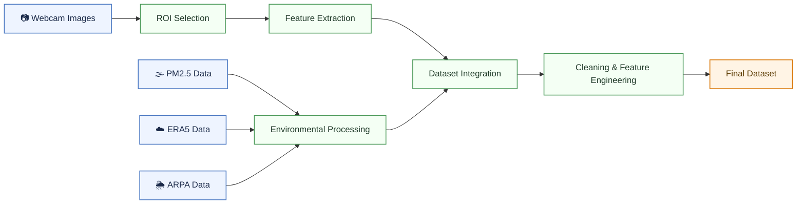

# Webcam-Based PM2.5 Environmental Data Toolbox

### An Automated Framework for Multi-Source Dataset Generation and Environmental Data Integration

This repository provides a Python-based environmental data processing toolbox for constructing webcam-based PM2.5 datasets through multi-source environmental data integration.

The framework integrates:

- Webcam image features
- PM2.5 air quality observations
- ERA5 meteorological reanalysis data
- ARPA Lombardia ground meteorological observations

The project provides a reproducible workflow for environmental data collection, preprocessing, harmonization, and analysis-ready dataset generation for PM2.5 analysis and machine learning applications.

---

# Overall Workflow


---
# Repository Structure

```text
webcam-pm25-toolbox/
├── .github/workflows/
│   └── webcam.yml
├── config/
│   └── roi.json
├── data/
│   ├── raw/
│   ├── interim/
│   └── processed/
├── notebooks/
│   ├── 01_Webcam-Based pm25 Dataset Pipeline.ipynb
│   └── 02_Dataset Cleaning and Preprocessing.ipynb
├── src/
│   ├── __init__.py
│   ├── webcam_download.py
│   ├── roi_viewer.py
│   ├── image_features.py
│   ├── eea_pm25_download.py
│   ├── era5_download.py
│   ├── merge_arpa_data.py
│   └── merge_all_data.py
├── reports/
├── requirements.txt
└── README.md
```
---

# Main Notebooks

## 01_Webcam-Based PM2.5 Dataset Pipeline.ipynb

This notebook implements the complete workflow for constructing the integrated environmental dataset.

Main workflow:

- Webcam image loading
- ROI selection
- ROI-based image feature extraction
- PM2.5 data download
- ERA5 meteorological data download and processing
- ARPA meteorological data merging
- Multi-source dataset integration

Main output:

```text
data/interim/merged_dataset.csv
```

---

## 02_Dataset Cleaning and Preprocessing.ipynb

This notebook performs:

- Data profiling
- Missing-value analysis
- Duplicate timestamp checking
- Outlier analysis
- Data cleaning
- Feature engineering
- Dataset validation

Main output:

```text
data/processed/final_dataset.csv
```

---

# Installation

Clone the repository:

```bash
git clone https://github.com/QingxuanTuo/webcam-pm25-toolbox.git
cd webcam-pm25-toolbox
```

Create virtual environment:

```bash
python -m venv .venv
```

Activate environment:

Windows:

```bash
.venv\Scripts\activate
```

Linux/macOS:

```bash
source .venv/bin/activate
```

Install dependencies:

```bash
pip install -r requirements.txt
```
---
# Quick Start

Launch Jupyter Notebook:

```bash
jupyter notebook
```

Run the complete environmental data pipeline:

```text
notebooks/01_webcam_pm25_dataset_pipeline.ipynb
```

Then perform dataset cleaning and preprocessing:

```text
notebooks/02_dataset_cleaning_preprocessing.ipynb
```
---

# （1）Webcam Image Collection

Webcam images are automatically collected from:

```text
https://www.meteogiuliacci.it/meteo-webcam/webcam-milano
```

using:

```text
src/webcam_download.py
```

The collection workflow is automated using GitHub Actions.

Pipeline overview:

```text
GitHub Actions
        ↓
Execute webcam_download.py
        ↓
Download Milan webcam images
        ↓
Save images locally
        ↓
Upload images to Google Drive
```

Downloaded images are later used for ROI-based image feature extraction.

---

# （2）ROI-Based Image Feature Extraction

Webcam image features are extracted using:

```text
src/image_features.py
```

The script extracts visual features from a predefined Region of Interest (ROI) selected from Milan webcam images.

The ROI is configured using:

```text
config/roi.json
```

and selected interactively inside:

```text
01_Webcam-Based PM2.5 Dataset Pipeline.ipynb
```

## Extracted Features

The extracted image features include:

```text
R_roi
G_roi
B_roi
S_mean
B_R_ratio
contrast
```

## Output Dataset

Output file:

```text
data/interim/image_features.csv
```

---

# （3）PM2.5 Data Download

Hourly PM2.5 observations are downloaded from the European Environment Agency (EEA) using:

```text
src/eea_pm25_download.py
```

Output dataset:

```text
data/interim/PM25_MI_hourly.csv
```

---

# （4）ERA5 Meteorological Data

ERA5 meteorological data are downloaded and processed using:

```text
src/era5_download.py
```

The workflow downloads:

- ERA5 single-level variables
- ERA5 pressure-level variables

Output dataset:

```text
data/interim/era5_all_merged.csv
```

## ERA5 CDS API Configuration

ERA5 download requires a Copernicus Climate Data Store account.

Register at:

```text
https://cds.climate.copernicus.eu/
```

Create the `.cdsapirc` file in your home directory.

Windows:

```text
C:\Users\YOUR_USERNAME\.cdsapirc
```

Linux/macOS:

```text
~/.cdsapirc
```

Example configuration:

```text
url: https://cds.climate.copernicus.eu/api
key: YOUR_UID:YOUR_API_KEY
```

---

# （5）ARPA Meteorological Data

Ground meteorological observations are obtained from ARPA Lombardia:

```text
https://www.arpalombardia.it/temi-ambientali/meteo-e-clima/form-richiesta-dati
```

Selected station:

```text
Milano - v. Marche
```

ARPA CSV tables are merged using:

```text
src/merge_arpa_data.py
```

Output dataset:

```text
data/interim/arpa_merged.csv
```

---

# （6）Multi-source Dataset Integration

All datasets are merged by UTC hourly timestamp using:

```text
src/merge_all_data.py
```

Integrated datasets:

```text
image_features.csv
PM25_MI_hourly.csv
era5_all_merged.csv
arpa_merged.csv
```

Output dataset:

```text
data/interim/merged_dataset.csv
```

The merged dataset contains:

- Webcam ROI image features
- PM2.5 observations
- ERA5 meteorological variables
- ARPA ground meteorological variables

---

# （7）Dataset Cleaning and Feature Engineering

The integrated dataset is further processed using:

```text
02_Dataset Cleaning and Preprocessing.ipynb
```

Input dataset:

```text
data/interim/merged_dataset.csv
```

Final output:

```text
data/processed/final_dataset.csv
```


## Data Profiling

The notebook analyzes:

- Dataset structure
- Missing values
- Temporal coverage
- Timestamp continuity
- Numerical distributions
- Correlation structure

Visualization includes:

- Missing-value matrix
- Histograms
- Correlation heatmaps
- Boxplots
- PM2.5 time-series plots


## Data Quality Assessment

The workflow checks:

- Missing values
- Duplicate rows
- Duplicate timestamps
- Invalid physical values
- Outliers using the IQR method
- Temporal consistency

## Data Cleaning

Cleaning operations include:

- Datetime conversion
- Chronological sorting
- Linear interpolation of missing values
- Wind-direction filling
- Invalid-value filtering
- Duplicate removal
- Numeric type conversion
- Removal of non-modeling columns


## Feature Engineering

Additional temporal and cyclical features are generated, including:

```text
hour
day
weekday
month
hour_sin
hour_cos
is_daytime
wind_dir_sin
wind_dir_cos
```

# Output Datasets

Main generated datasets:

```text
data/interim/image_features.csv
data/interim/PM25_MI_hourly.csv
data/interim/era5_all_merged.csv
data/interim/arpa_merged.csv
data/interim/merged_dataset.csv
data/processed/final_dataset.csv
```


