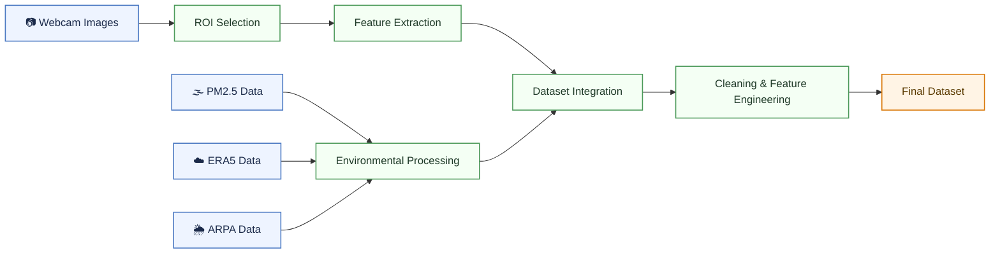

# Webcam-Based PM2.5 Environmental Data Toolbox

### An Automated Framework for Multi-Source Dataset Generation and Environmental Data Integration

This repository provides a Python-based environmental data processing toolbox for constructing webcam-based PM2.5 datasets through multi-source environmental data integration.

The framework integrates:

- Webcam image features
- PM2.5 air quality observations
- ERA5 meteorological reanalysis data
- ARPA Lombardia ground meteorological observations

The project provides a reproducible workflow for environmental data collection, preprocessing, harmonization, and analysis-ready dataset generation for PM2.5 analysis and machine learning applications.

---

# Overall Workflow


---
# Repository Structure

```text
webcam-pm25-toolbox/
├── .github/workflows/
│   └── webcam.yml
├── config/
│   └── roi.json
├── data/
│   ├── raw/
│   ├── interim/
│   └── processed/
├── docs/
├── notebooks/
│   ├── 01_webcam_pm25_dataset_pipeline.ipynb
│   └── 02_dataset_cleaning_preprocessing.ipynb
├── src/
│   ├── __init__.py
│   ├── webcam_download.py
│   ├── roi_viewer.py
│   ├── image_features.py
│   ├── eea_pm25_download.py
│   ├── era5_download.py
│   ├── merge_arpa_data.py
│   └── merge_all_data.py
├── reports/
├── requirements.txt
└── README.md
```
---
# Installation

Clone the repository:

```bash
git clone https://github.com/QingxuanTuo/webcam-pm25-toolbox.git
cd webcam-pm25-toolbox
```

Install dependencies:

```bash
pip install -r requirements.txt
```

The project can be executed either:

- locally using Jupyter Notebook;
- or directly in Google Colab.

For local execution, webcam images stored in Google Drive should be downloaded into:

```text
data/raw/images
```

before running the notebooks.

---

## ERA5 CDS API Configuration

ERA5 downloading requires a Copernicus Climate Data Store (CDS) account.

Register at:

```text
https://cds.climate.copernicus.eu/
```

Create a `.cdsapirc` file in your home directory.

Windows:

```text
C:\Users\YOUR_USERNAME\.cdsapirc
```

Linux/macOS:

```text
~/.cdsapirc
```

Example configuration:

```text
url: https://cds.climate.copernicus.eu/api
key: YOUR_UID:YOUR_API_KEY
```
---
# Automated Webcam Collection

Webcam images are automatically collected from the Milan webcam platform using a scheduled GitHub Actions workflow.

The automation pipeline is defined in:

```text
.github/workflows/webcam.yml
```

and implemented using:

```text
src/webcam_download.py
```

The workflow performs:

- automated webcam image downloading;
- timestamp-based image organization;
- and automatic upload to Google Drive.

The automated workflow can be triggered directly from the GitHub Actions tab:

```text
Actions → webcam → Run workflow
```
The pipeline enables continuous and reproducible long-term environmental image collection without requiring manual notebook execution.

---
# Quick Start

Run the notebooks in the following order.

---

## 1. Main Environmental Data Pipeline

Run:

```text
notebooks/01_webcam_pm25_dataset_pipeline.ipynb
```

This notebook performs:

- ROI selection and visual analysis
- ROI-based image feature extraction
- PM2.5 data downloading
- ERA5 meteorological data processing
- ARPA Lombardia data merging
- Multi-source dataset integration

Main output:

```text
data/interim/merged_dataset.csv
```

---

## 2. Dataset Cleaning and Preprocessing

Run:

```text
notebooks/02_dataset_cleaning_preprocessing.ipynb
```

This notebook performs:

- dataset cleaning
- missing-value handling
- feature engineering
- temporal validation
- final dataset generation

Main output:

```text
data/processed/final_dataset.csv
```
---
# Generated Datasets

Main generated datasets:

```text
data/interim/image_features.csv
data/interim/PM25_MI_hourly.csv
data/interim/era5_all_merged.csv
data/interim/arpa_merged.csv
data/interim/merged_dataset.csv
data/processed/final_dataset.csv
```

Dataset description:

| Dataset | Description |
|---|---|
| image_features.csv | ROI-based image-derived visual features |
| PM25_MI_hourly.csv | Hourly PM2.5 observations from the EEA station |
| era5_all_merged.csv | Processed ERA5 meteorological variables |
| arpa_merged.csv | ARPA Lombardia environmental observations |
| merged_dataset.csv | Multi-source integrated environmental dataset |
| final_dataset.csv | Cleaned and analysis-ready final dataset |

---
This toolbox provides a reproducible environmental data processing workflow for webcam-based PM2.5 analysis and future machine learning applications.
