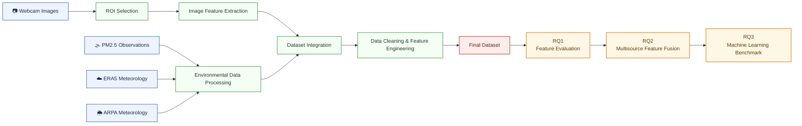

# Webcam-Based PM2.5 Estimation Using Image Features and Multi-Source Environmental Data

### A Reproducible Framework for Webcam-Based Air Quality Estimation and Machine Learning Benchmarking

This repository contains the complete implementation of a research project on image-based PM2.5 estimation using webcam imagery and multi-source environmental data.

The framework provides an end-to-end and reproducible workflow, covering data collection, preprocessing, feature extraction, feature evaluation, multisource data fusion, and machine learning model benchmarking for ambient PM2.5 estimation.

The project integrates four complementary data sources:

- Webcam image-derived visual features
- PM2.5 measurements from EEA monitoring stations
- ERA5 reanalysis meteorological variables
- ARPA Lombardia ground meteorological observations

The repository also includes systematic ROI selection, physically interpretable image feature extraction, multisource feature fusion, and a comprehensive benchmark of multiple machine learning models under a unified evaluation framework.

---

# Overall Workflow


---
# Repository Structure

```text
webcam-pm25-toolbox/
│
├── .github/
│   └── workflows/
│       └── webcam.yml              # Automated webcam image collection
│
├── config/
│   └── roi.json                    # ROI configuration
│
├── data/
│   ├── raw/                        # Raw downloaded data (not included)
│   ├── interim/                    # Intermediate processed datasets
│   └── processed/                  # Final analysis-ready dataset
│
├── docs/
│   ├── Project Progress Report.pdf
│   └── ROI Selection and Feature Extraction Strategy.pdf
│
├── notebooks/
│   ├── 01_webcam_pm25_dataset_pipeline.ipynb
│   ├── 02_dataset_cleaning_preprocessing.ipynb
│   ├── 03_feature_evaluation_and_multisource_fusion.ipynb
│   └── 04_machine_learning_model_benchmark.ipynb
│
├── results/
│   ├── feature_evaluation/         # Figures and tables for Notebook 3
│   └── model_benchmark/            # Figures and tables for Notebook 4
│
├── src/
│   ├── features/
│   │   ├── __init__.py
│   │   ├── evaluation.py
│   │   └── features_plots.py
│   │
│   ├── models/
│   │   ├── __init__.py
│   │   ├── benchmark.py
│   │   └── benchmark_plots.py
│   │
│   ├── __init__.py
│   ├── config.py
│   ├── webcam_download.py
│   ├── roi_viewer.py
│   ├── image_features.py
│   ├── eea_pm25_download.py
│   ├── era5_download.py
│   ├── merge_arpa_data.py
│   └── merge_all_data.py
│
├── requirements.txt
└── README.md
```
---
# Installation

Clone the repository:

```bash
git clone https://github.com/QingxuanTuo/webcam-pm25-toolbox.git
cd webcam-pm25-toolbox
```

Install dependencies:

```bash
pip install -r requirements.txt
```

The project can be executed either:

- locally using Jupyter Notebook;
- or directly in Google Colab.

For local execution, webcam images stored in Google Drive should be downloaded into:

```text
data/raw/images
```

before running the notebooks.

---

## ERA5 CDS API Configuration

ERA5 downloading requires a Copernicus Climate Data Store (CDS) account.

Register at:

```text
https://cds.climate.copernicus.eu/
```

Create a `.cdsapirc` file in your home directory.

Windows:

```text
C:\Users\YOUR_USERNAME\.cdsapirc
```

Linux/macOS:

```text
~/.cdsapirc
```

Example configuration:

```text
url: https://cds.climate.copernicus.eu/api
key: YOUR_UID:YOUR_API_KEY
```
---
# Automated Webcam Collection

Webcam images are automatically collected from the Milan webcam platform using a scheduled GitHub Actions workflow.

The automation pipeline is defined in:

```text
.github/workflows/webcam.yml
```

and implemented using:

```text
src/webcam_download.py
```

The workflow performs:

- automated webcam image downloading;
- timestamp-based image organization;
- and automatic upload to Google Drive.

The automated workflow can be triggered directly from the GitHub Actions tab:

```text
Actions → webcam → Run workflow
```
The pipeline enables continuous and reproducible long-term environmental image collection without requiring manual notebook execution.

---
# Research Questions

This project is designed to address the following research questions:

- **RQ1:** Can ROI-based image features effectively characterize PM2.5 variations?
- **RQ2:** Does multisource feature fusion improve PM2.5 estimation performance?
- **RQ3:** How do machine learning models with different levels of complexity compare in webcam-based PM2.5 estimation?
---

# Quick Start

The project is organized into four sequential notebooks. Running them in order reproduces the complete workflow, from data collection to model benchmarking.

---

## 1. Webcam PM2.5 Dataset Pipeline

Run:

```text
notebooks/01_webcam_pm25_dataset_pipeline.ipynb
```

This notebook performs:

- Webcam image collection
- PM2.5 data downloading from EEA
- ERA5 meteorological data downloading and processing
- ARPA Lombardia data preprocessing
- Multi-source dataset integration

Main outputs:

```text
data/interim/
├── PM25_MI_hourly.csv
├── era5_all_merged.csv
├── arpa_merged.csv
└── merged_dataset.csv
```

---

## 2. Dataset Cleaning and Image Feature Extraction

Run:

```text
notebooks/02_dataset_cleaning_preprocessing.ipynb
```

This notebook performs:

- Dataset cleaning and quality control
- Missing-value handling
- ROI selection and visual comparison
- ROI-based image feature extraction
- Feature engineering
- Final dataset generation

Main outputs:

```text
data/interim/image_features.csv

data/processed/final_dataset.csv
```

---

## 3. Feature Evaluation and Multisource Feature Fusion

Run:

```text
notebooks/03_feature_evaluation_and_multisource_fusion.ipynb
```

This notebook investigates the first two research questions:

- Evaluation of image-derived features
- Comparison of ROI-based feature extraction strategies
- Incremental multisource feature fusion
- Performance analysis using linear and ensemble models

Main outputs:

```text
results/feature_evaluation/
```

---

## 4. Machine Learning Model Benchmark

Run:

```text
notebooks/04_machine_learning_model_benchmark.ipynb
```

This notebook addresses the final research question by benchmarking multiple machine learning models.

The notebook includes:

- Cross-validation performance comparison
- Independent test evaluation
- Prediction scatter analysis
- Residual analysis
- Computational efficiency comparison
- Feature importance analysis

Main outputs:

```text
results/model_benchmark/
```
---
# Generated Datasets

The workflow produces the following intermediate and final datasets.

| Dataset | Description |
|---|---|
| `image_features.csv` | ROI-based image-derived visual features extracted from webcam images |
| `PM25_MI_hourly.csv` | Hourly PM2.5 observations downloaded from the EEA monitoring station |
| `era5_all_merged.csv` | Processed ERA5 meteorological variables |
| `arpa_merged.csv` | Processed ARPA Lombardia ground meteorological observations |
| `merged_dataset.csv` | Integrated multi-source environmental dataset |
| `final_dataset.csv` | Cleaned and analysis-ready dataset used for feature evaluation and model benchmarking |

---

# Repository Outputs

Running the complete workflow also generates:

- Publication-quality figures for feature evaluation
- Performance comparison of multisource feature fusion
- Benchmark results for multiple machine learning models
- Cross-validation and independent test evaluation
- Residual analysis and computational efficiency comparison
- Feature importance analysis

All figures and evaluation results are automatically saved in:

```text
results/
├── feature_evaluation/
└── model_benchmark/
```

---

This repository provides a fully reproducible research framework for webcam-based PM2.5 estimation, covering environmental data collection, image feature extraction, multisource feature fusion, and comprehensive machine learning benchmarking.
